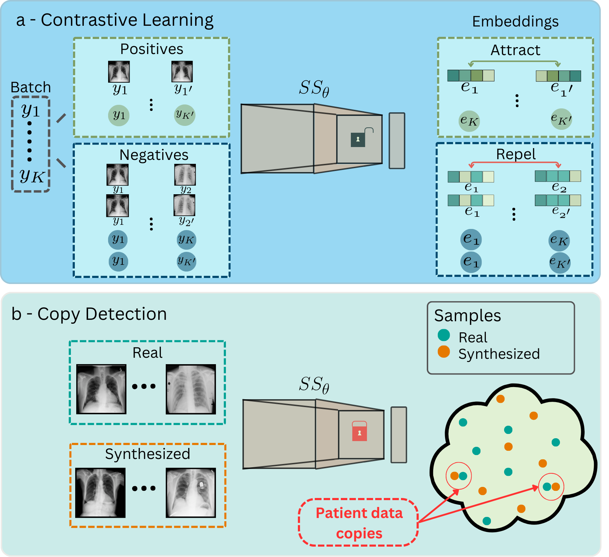

# Memorization in Latent Diffusion Models


This repository contains code to train and evaluate self-supervised models for memorization detection in Latent Diffusion Models. Images are first projected onto a low-dimentional embedding space where the models are trained to attract each sample with its variations (flipped and rotated versions), and repel each sample from other samples and their vriations. 

After training all real training, real validation and synthesized samples are projected onto low-dimentional embedding space and pairwise correlations are computed between all training-synthetic and training-validation pairs. Afterward, for each training smaple the closest validation sample is selected based on the correlation values, and a threshold value is defined based on 95th percentile of correlation values between training and closest validation samples. All synthetic samples having correlation vlaues greater than the threshold values are categorized as patient data copies.

 

## Table of Contents
- [Setup Instructions](#installation)
- [Usage](#usage)
- [Data and Pre-Trained Models](#)
- [Paper](#paper)


## Setup Instructions (Ubuntu)
The code has been tested on Python 3.9.19 and Ubuntu 22.04.1.

Create a conda environment from environment.yml 
```
conda env create -f environment.yml -n memorization-ldm
```
Activate environment
```
conda activate memorization-ldm 
```

## Usage
2D self-supervised models can be trained by executing the following command in terminal.
```
python train_selfsupervised2D.py --data_dir data/NIHXRay/ --dataset NIHXRay --exp exp2D_1/
```
3D self-supervised models can be trained by executing the following command in terminal.
```
python train_selfsupervised3D.py --data_dir data/MRNet-v1.0/ --dataset mrnet --exp exp3D_1/
```

Memorization in 2D and 3D models can be assessed via memorization_assessment2D.ipynb and memorization_assessment3D.ipynb notebooks respectively.

## Data and Pre-Trained Models
This repository contains implementation on publicly available [X-Ray](https://arxiv.org/abs/2402.01054) and [MRNet](https://www.kaggle.com/datasets/nih-chest-xrays/data) datasets. Synthesized sampels can be shared upon request and proof that the requester has access to the corresponding public datasets. Please contact [Salman Ul Hassan Dar](mailto:SalmanUlHassan.Dar@med.uni-heidelberg.de).

Checkpoints of the trained self supervised models can be downloaded from [here](https://heibox.uni-heidelberg.de/d/f8ed76adc8ad488596c5/).

## Paper

Please cite the following paper if you use/modify or adapt part of the code from this repository:

Salman Ul Hassan Dar, Marvin Seyfarth, Jannik Kahmann, Isabelle Ayx, Theano Papavassiliu, Stefan O. Schoenberg, Norbert Frey, Bettina Baeßler, Sebastian Foersch, Daniel Truhn, Jakob Nikolas Kather, Sandy Engelhardt, "Unconditional Latent Diffusion Models Memorize Patient Imaging Data: Implications for Openly Sharing Synthetic Data," arXiv preprint, doi: 10.48550/arXiv.2402.01054.

- Link the pre-print version is available here: [arxiv-Preprint](https://arxiv.org/abs/2402.01054)

